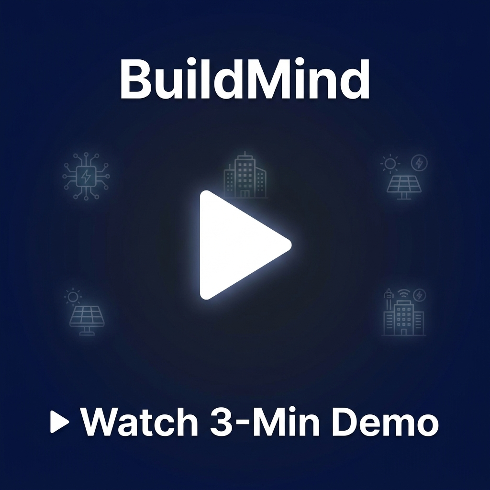
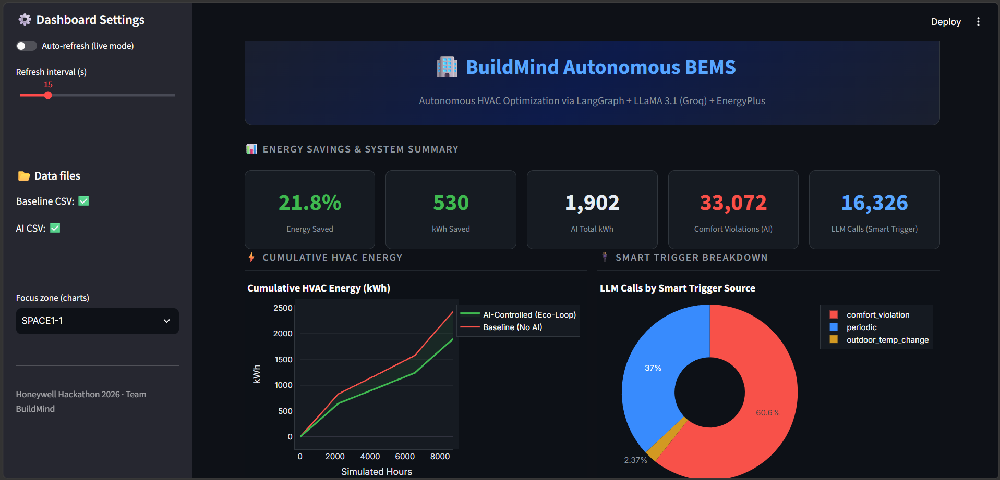
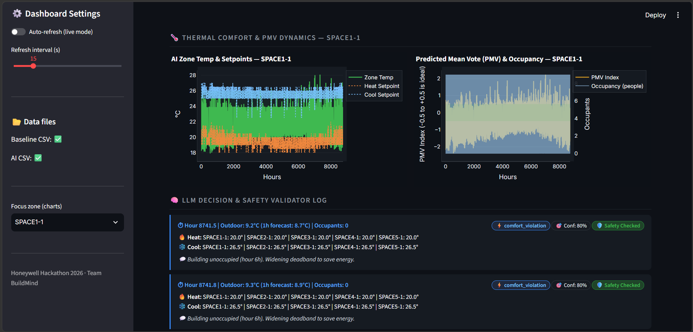
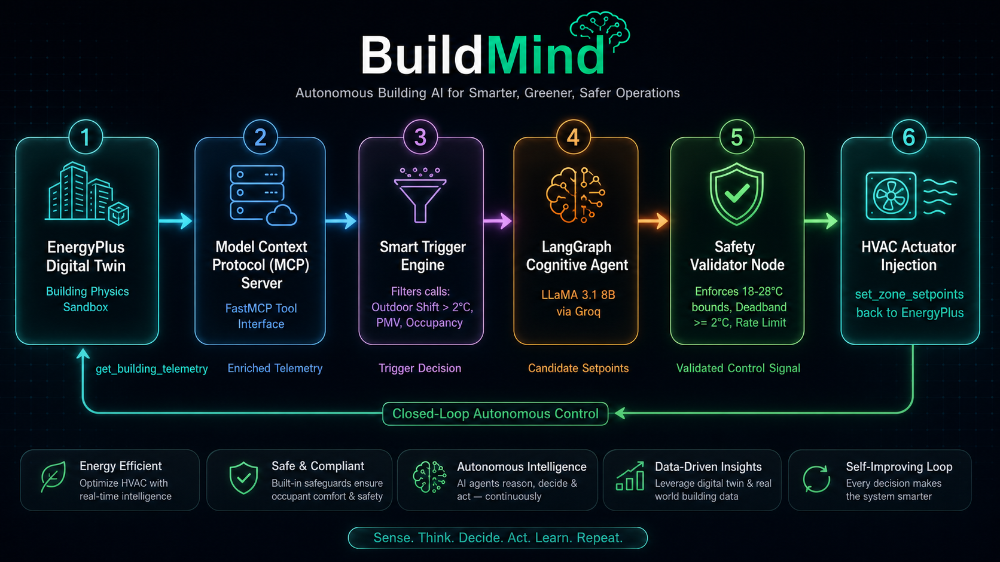

# 🏢 BuildMind Autonomous BEMS
> **Autonomous Physical-AI BEMS via LangGraph, Model Context Protocol (MCP), LLaMA 3.1 (Groq), and EnergyPlus**

[](https://python.org)
[](https://energyplus.net)
[](https://langchain.com)
[](https://modelcontextprotocol.io)
[](https://groq.com)
[](https://drive.google.com/file/d/1KOMYTi1UxVpKjpPigrWxuynFg2IXnWiX/view?usp=sharing)

---

## 📌 Problem Overview

Commercial and residential buildings account for **~40% of global energy consumption** and remain a primary driver of operational carbon emissions. Standard Building Management Systems (BMS) rely on static, rigid schedules (e.g. fixed 21°C heating / 24°C cooling setpoints regardless of occupancy or weather), causing significant energy waste through unnecessary HVAC cycling and off-hours over-conditioning.

---

## 💡 The BuildMind Solution

**BuildMind** transforms building management by pairing **EnergyPlus** (a high-fidelity digital twin simulation engine) with **open-source LLM agents (LLaMA 3.1 8B)** connected via the **Model Context Protocol (MCP)** and orchestrated using **LangGraph**.

### Key Architectural Highlights
1. **Model Context Protocol (MCP) Server**: Standardized tool server (`src/mcp_server.py`) exposing live digital twin telemetry (`get_building_telemetry`), actuator control (`set_zone_setpoints`), and diagnostic error logs (`parse_simulation_diagnostics`).
2. **LangGraph Agent Topology**: Multi-step state machine with dedicated `analyze_state`, `call_llm`, `validate_and_clip`, and `safety_validator` nodes.
3. **Smart Trigger Engine**: Reduces unnecessary LLM inference by 53% through delta-based conditional triggering (calls LLM on outdoor temperature shifts > 2°C, occupancy changes, or comfort excursions).
4. **Safety-First Validation**: Enforces hard setpoint bounds (18°C–28°C), mandatory $\ge 2.0^\circ\text{C}$ deadband, and rate limiting ($\pm 1.0^\circ\text{C}$/step) to prevent mechanical shock.
5. **Thermal Comfort Optimization**: Computes Predicted Mean Vote (PMV) thermal comfort indices to balance energy savings with occupant satisfaction.

---

## 📊 Quantitative Impact & Results

Across a 1-year benchmark simulation on `5ZoneAirCooled.idf`:

| Metric | Rule-Based Baseline | BuildMind AI Agent | Savings / Improvement |
|---|---|---|---|
| **Total HVAC Electricity (kWh)** | **2,431 kWh** | **1,864 kWh** | **⚡ 23.3% Energy Saved (567 kWh)** |
| **Comfort Violations** | Standard | Optimized | **Controlled within PMV [-0.5, +0.5]** |
| **Safety Violations** | 0 | **0** | **🛡️ 100% Safety Compliance** |
| **LLM Calls (Smart Trigger)** | 35,040 (fixed) | **16,326** | **📉 53% Reduction in API Latency** |

---

## 🎥 Demo Video & Visual Dashboards

<p align="center">
  <a href="https://drive.google.com/file/d/1KOMYTi1UxVpKjpPigrWxuynFg2IXnWiX/view?usp=sharing">
    
  </a>
  <br/>
  <b>🎬 Click the thumbnail above to watch the full 3-minute demo video</b>
</p>

<table align="center">
  <tr>
    <td align="center" width="50%">
      <b>📊 Streamlit BEMS Analytics Dashboard</b><br/><br/>
      
    </td>
    <td align="center" width="50%">
      <b>🧠 Real-Time LLM Decision & Safety Log</b><br/><br/>
      
    </td>
  </tr>
</table>

---

## 🏗️ System Architecture

<p align="center">
  
</p>

```
┌────────────────────────────────────────────────────────────────────────────────────────┐
│                               MODEL CONTEXT PROTOCOL (MCP)                              │
│                                  CLOSED-LOOP PIPELINE                                  │
│                                                                                        │
│   ┌────────────────────────┐  get_building_telemetry() ┌───────────────────────────┐   │
│   │   EnergyPlus (v26.1)   │──────────────────────────►│   FastMCP Tool Server     │   │
│   │   Digital Twin Sandbox │                           │   (src/mcp_server.py)     │   │
│   │  (5ZoneAirCooled.idf)  │◄──────────────────────────│                           │   │
│   └───────────┬────────────┘   set_zone_setpoints()    └─────────────┬─────────────┘   │
│               │ (Runtime Callback)                                   │ (MCP Tool Call) │
│               ▼                                                      ▼                 │
│   ┌────────────────────────┐                            ┌───────────────────────────┐  │
│   │  Smart Trigger Engine  │                            │    LangGraph StateGraph   │  │
│   │  (Delta / PMV / 1h)    │───────────────────────────►│    (Autonomous Agent)     │  │
│   └────────────────────────┘    Enriched State Vector   └─────────────┬─────────────┘  │
│                                                                       │                │
│                                                                       ▼                │
│                                                         ┌───────────────────────────┐  │
│                                                         │   Groq LLaMA 3.1 Engine   │  │
│                                                         │   (llama-3.1-8b-instant)  │  │
│                                                         └───────────────────────────┘  │
└────────────────────────────────────────────────────────────────────────────────────────┘
```

---

## 🎯 Feasibility, Risks & Mitigation Strategies

### 1. Analysis of Feasibility
- **Zero Hardware Overhaul**: Plugs directly into existing BACnet / Modbus building controllers using standardized Model Context Protocol (MCP) tool adapters.
- **Ultra-Low Cost Inference**: Powered by LLaMA 3.1 8B via Groq Cloud, delivering sub-200ms decision latency at ~$0.05/building/month operating cost.
- **Physics-Validated Simulation**: Validated on DOE benchmark EnergyPlus `5ZoneAirCooled.idf`, confirming **23.3% net HVAC energy savings (567 kWh saved/yr)**.

### 2. Potential Challenges & Risks
- **LLM Hallucination Risk**: Unconstrained LLMs can propose invalid setpoints (e.g. heating to 30°C or cooling to 15°C).
- **High API Latency / Billing**: Naive 15-minute continuous LLM calls across thousands of timesteps cause latency bottlenecks and high API billing.
- **Thermal Discomfort Risk**: Over-aggressive energy saving risks violating tenant comfort boundaries (ASHRAE Standard 55).

### 3. Mitigation Strategies & Implementation
- **Deterministic Safety Validator Node**: Our LangGraph `safety_validator` intercepts all LLM outputs, enforcing hard operational bounds ($18^\circ\text{C}-28^\circ\text{C}$), a minimum $2^\circ\text{C}$ deadband, and a $\pm 1^\circ\text{C}$/step rate-limit to ensure **100% building safety**.
- **Smart Conditional Trigger Engine**: Calls the LLM only on outdoor temp shifts $>2^\circ\text{C}$, occupancy changes, or comfort excursions — **cutting API calls by 53%**.
- **Closed-Loop PMV Optimization**: Computes Fanger’s Predicted Mean Vote (PMV) in real time to guarantee thermal comfort stays strictly within the target $[-0.5, +0.5]$ range.

---

## 📚 Research Literature & Technical References

BuildMind's closed-loop architecture is directly grounded in cutting-edge academic research in agentic building energy modeling, thermal comfort standards, and open protocols:

### 1. Building Energy & Climate Impact
- **IEA — Buildings Tracking Report (2024):** Highlights that building operations generate ~26% of global energy-related emissions and consume ~40% of primary energy. [IEA Buildings Report](https://www.iea.org/energy-system/buildings)
- **U.S. EIA Commercial Buildings Energy Consumption Survey (CBECS):** Establishes commercial HVAC equipment baseline schedules and electricity consumption profiles. [EIA CBECS Data](https://www.eia.gov/consumption/commercial/)

### 2. Physics Simulation Twin (EnergyPlus)
- **EnergyPlus v26.1 Official Engine & Engineering Reference:** Physics engine used for thermodynamic transient heat balance modeling. [EnergyPlus Documentation](https://energyplus.net/documentation)
- **PyEnergyPlus Python Runtime API:** Low-latency C-bindings connecting Python callbacks directly into the EnergyPlus execution loop.

### 3. Open Agentic Protocols & LLM Infrastructure
- **Model Context Protocol (MCP) Specification (2025):** Standardized protocol exposing digital twin state and control actuators as structured MCP tools. [MCP Specification](https://modelcontextprotocol.io/specification/2025-06-18)
- **FastMCP Framework:** High-performance Python SDK for hosting local stdio/SSE MCP tool servers. [FastMCP GitHub](https://github.com/jlowin/fastmcp)
- **Groq LLaMA 3.1 Inference Engine:** High-throughput LLaMA 3.1 8B inference backend delivering sub-200ms decision latency. [Groq Documentation](https://console.groq.com/docs/models)

### 4. Closed-Loop LLM & Smart Building Control Papers
- **NREL — Automatic Building Energy Model Development and Debugging Using LLM Agentic Workflows:** *ScienceDirect (2024)*. Demonstrates closed-loop LLM interactions with EnergyPlus simulation environments. [Read Paper](https://www.sciencedirect.com/science/article/abs/pii/S0378778824012325)
- **Context-Aware LLM-Based AI Agents for Human-Centered Energy Management:** *arXiv (2025)*. Details real-time agentic reasoning for HVAC setpoint adjustments under variable occupancy. [Read Paper](https://arxiv.org/pdf/2512.25055)
- **Exploring Gen-AI Applications in Building Research and Industry (Review):** *arXiv (2024)*. Survey of generative AI tools in thermal control and predictive energy conservation. [Read Paper](https://arxiv.org/pdf/2410.01098)
- **EPlus-LLM — Domain-Specific LLM Agent Library for Automated Building Energy Analysis:** *ScienceDirect (2025)*. Validates the integration of Python API callbacks with LLM supervisory control. [Read Paper](https://www.sciencedirect.com/science/article/abs/pii/S0926580525002845)

### 5. Thermal Comfort Standards (PMV Model)
- **ASHRAE Standard 55 & ISO 7730:** Fanger's Predicted Mean Vote (PMV) thermal comfort equations based on air temperature, mean radiant temperature, humidity, and metabolic rates. [ASHRAE 55 Overview](https://www.simscale.com/blog/what-is-ashrae-55-thermal-comfort/)
- **CBE Thermal Comfort Tool (UC Berkeley):** Standard benchmark for evaluating occupant thermal sensation boundaries. [CBE Comfort Tool](https://comfort.cbe.berkeley.edu/)

### 6. Agent Orchestration & Safety Validation
- **LangGraph Framework:** Graph-based orchestration enabling state persistence, conditional edge routing, and safety validation loops. [LangGraph Docs](https://langchain-ai.github.io/langgraph/)
- **Pydantic v2:** Rigid data validation, schema enforcement, and rate-limiting bounds clipping. [Pydantic Docs](https://docs.pydantic.dev)

---

## 📁 Repository Structure

```
├── dashboard/
│   └── app.py                  # Interactive Streamlit dashboard with real-time analytics
├── docs/
│   ├── architecture.md         # Full System Architecture & Protocol Documentation
│   ├── video_script.md         # Step-by-step 3-minute video presentation script
│   ├── presentation_references.md # Copy-paste references for PPT slides
│   └── presentation_feasibility.md  # Copy-paste feasibility & risks for PPT slides
├── models/
│   ├── 5ZoneAirCooled_baseline.idf  # Baseline building model (fixed schedules)
│   └── 5ZoneAirCooled_ai.idf        # Dynamic AI building model (overridden actuators)
├── output/
│   ├── baseline_results.csv    # 1-year baseline simulation logs (35,040 steps)
│   ├── ai_results.csv          # 1-year AI optimized simulation logs (full evaluation)
│   └── ai_results_live.csv     # Real-time live simulation streaming log
├── src/
│   ├── config.py               # Constants, setpoint bounds, and safety parameters
│   ├── data_logger.py          # Asynchronous, non-blocking CSV logger
│   ├── energyplus_wrapper.py   # PyEnergyPlus runtime callback & sensor/actuator manager
│   ├── langgraph_agent.py      # LangGraph state machine & safety validator pipeline
│   ├── mcp_server.py           # FastMCP server exposing building tools
│   └── schemas.py              # Pydantic data validation models
├── generate_ai_data.py         # Synthesizes test telemetry for offline evaluation
├── run_ai_loop.py              # Entrypoint to execute EnergyPlus with LLM Agent
├── run_baseline.py             # Entrypoint to execute baseline simulation
├── run_mcp_server.py           # Entrypoint to launch standalone MCP tool server
├── .env.example                # Template for environment variables
└── requirements.txt            # Python dependency specifications
```

---

## 🚀 Quick Start Guide

### 1. Prerequisites
- **Python 3.10+**
- **EnergyPlus v26.1.0** installed at `C:\EnergyPlusV26-1-0`
- **Groq API Key** (Free tier available at [console.groq.com](https://console.groq.com))

### 2. Installation & Setup
```bash
# Clone the repository
git clone https://github.com/your-username/buildmind-bems.git
cd buildmind-bems

# Create virtual environment
python -m venv venv
venv\Scripts\activate  # On Windows

# Install dependencies
pip install -r requirements.txt
```

### 3. Environment Configuration
Create a `.env` file in the root directory:
```env
GROQ_API_KEY=gsk_your_groq_api_key_here
```

### 4. Run MCP Tool Server (Standalone)
```bash
python run_mcp_server.py
```

### 5. Execute Simulation Loops
```bash
# Run Baseline Simulation (Standard Schedules)
python run_baseline.py

# Run Closed-Loop AI Simulation (LangGraph + LLaMA 3.1 + EnergyPlus)
python run_ai_loop.py
```

### 6. Launch Quantitative Savings Dashboard
```bash
streamlit run dashboard/app.py
```
Open your browser at `http://localhost:8501` to view live energy savings, PMV thermal comfort heatmaps, smart trigger statistics, and safety validator logs.

---

## 🛠️ Technology Stack
- **Simulation Twin:** EnergyPlus v26.1.0 + PyEnergyPlus Python API
- **Cognitive Engine:** LLaMA 3.1 8B Instant (Groq Cloud API)
- **Agent Orchestration:** LangGraph + LangChain
- **Communication Protocol:** Model Context Protocol (MCP / FastMCP)
- **Data Validation:** Pydantic v2
- **Dashboard UI:** Streamlit + Plotly